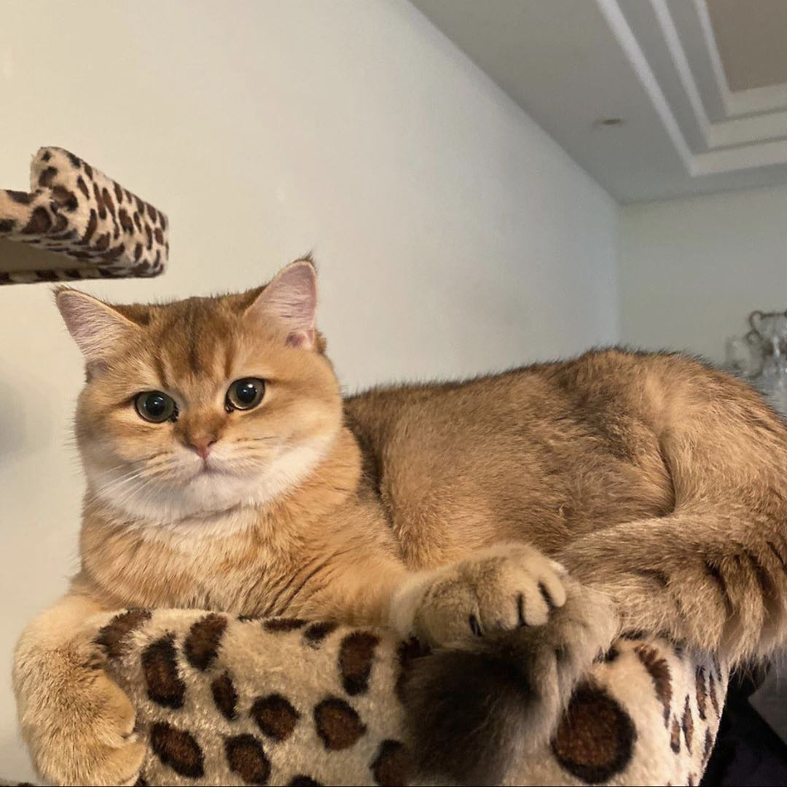

I am currently a first year master student in biostatistics at Columbia University mailman school of public health. Learn more about me in this website!  

 

  

#### Experience 
I had several research experiences. I have a strong interest in statistical learning and causal inference.  
You can learn more about me via [experience](about.html), and my [CV](files/P8105_cv.pdf).

#### Dashboard
I created a dashboard for the NOAA dataset. Click to find out more. [dashboard](dashboard.html)